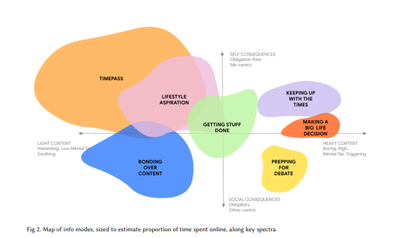

Theres several images that made 2025 interesting. This image from Jigsaw’s paper on GenAI usage amongst teens was one of them. 

*Xu, R., Le, N., Park, R., Murray, L., Das, V., Kumar, D., & Goldberg, B. (2024). New contexts, old heuristics: How young people in India and the US trust online content in the age of generative AI (arXiv preprint arXiv:2405.02522). https://doi.org/10.48550/arXiv.2405.02522*

In essence, we can think of content consumption patterns as split between time spent on personal-social content, and low-high cognitively demanding content. Doomscrolling would be personal oriented, low cognitively demanding content consumption. Prepping for a debate, or being informed so that you can talk to your peers would be in the socially focused, cognitively demanding quadrant.

Oddly, this suggests to me that misinformation is essentially an issue of Free time vs productive conversation.

To me, all conversations are fundamentally attempts at problem solving, except for inauthentic behavior. Trolls, bots, motivated reasoners, propagandists, these are entities which have no real desire to come to consensus. For them the engagement, the wasting of your energy, the attention, are the goals they seek.

In contrast, even someone with views one might consider reprehensible, see their positions as ways to make the world a better place. There’s a reason the road to Hell is paved with good intentions.

 The interesting part of this, is that authentic actors actually *want* to work. They have some values and wants, some version of a better state they want to get to. 
 
 Granted, even authentic participants may be overwhelmed by the actions asked of them, but this can be considered an issue with scope or project management. All things being equal, If the task were broken down into the smallest achievable action, they will act on it.  

In contrast, inauthentic actors have don’t have a minimum task size, and they exit when it turns to work. It is inefficient for them to spend time on burning calories and cognitive effort on those tasks.

As a result misinformation spread is a function of people who want to get work done, dealing with people who want to waste or redirect their efforts. 

Ok, theres lots wrong with this article, several positions are worded more emphatically than I am happy with, but I think I should have put the core forces together.have put the core forces together in 